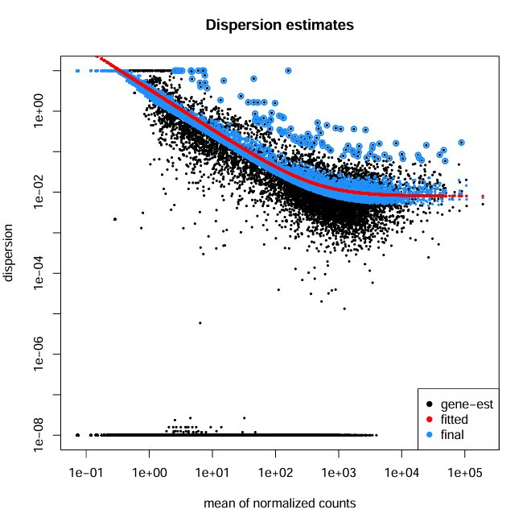
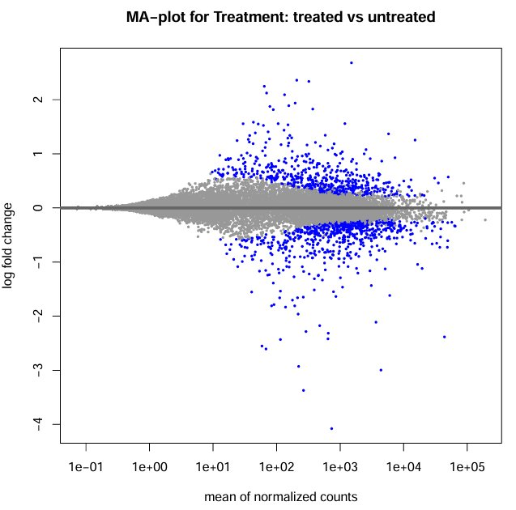
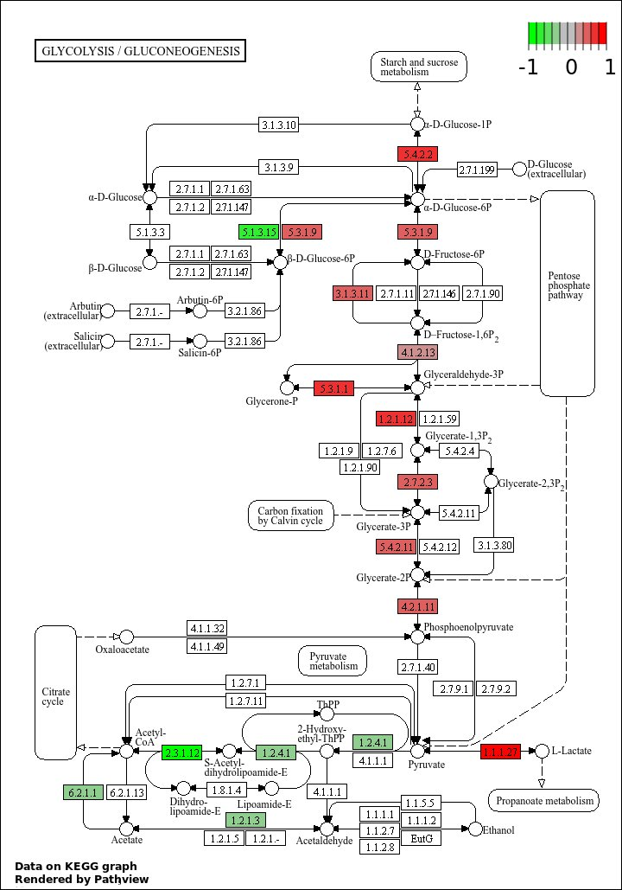
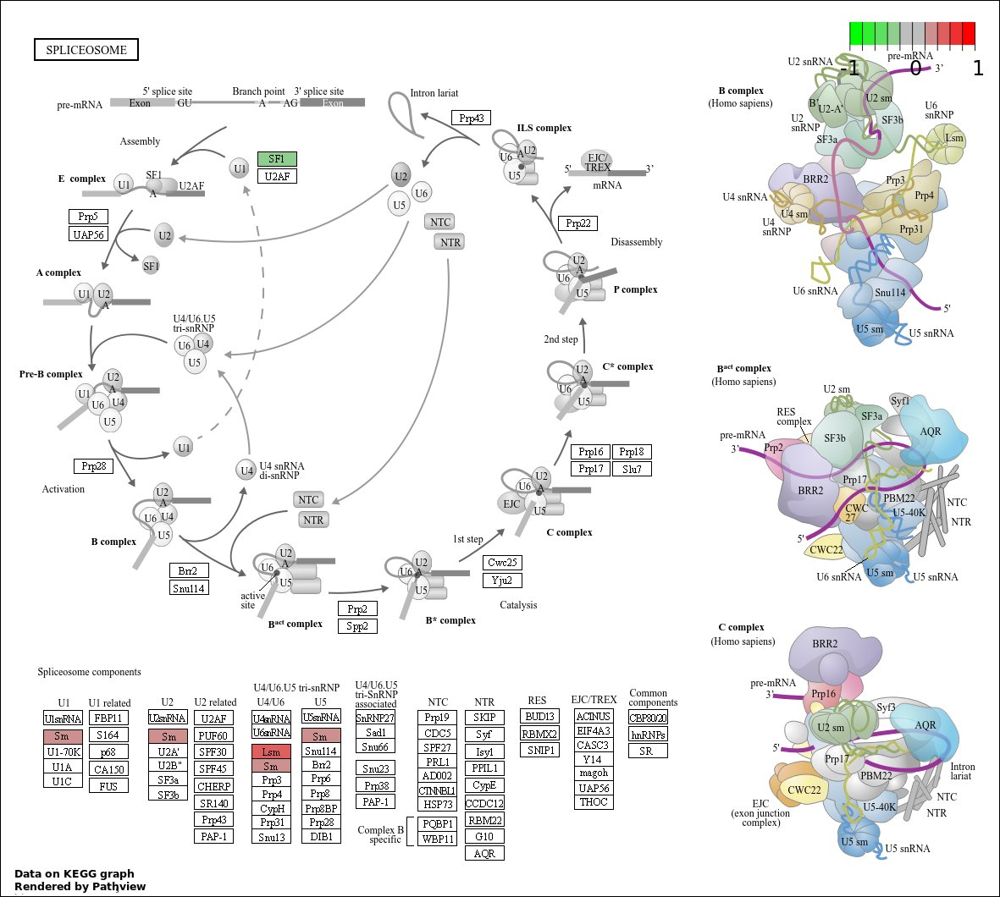

# Reference-Based RNA-Seq Data Analysis
### *Drosophila melanogaster* — Treated vs. Untreated (Galaxy Pipeline)

This repository contains all outputs from a reference-based RNA-Seq analysis pipeline run on the Galaxy platform, following the [RNA-Bio tutorial](https://rnabio.org/course/). The dataset is a subset of the Pasilla dataset (Brooks et al., 2011), comparing *Drosophila melanogaster* samples with and without RNAi knockdown of the *pasilla* gene.

---

## Dataset Overview

| Sample Accession | Condition | Library Type |
|---|---|---|
| GSM461177 | Untreated | Paired-end |
| GSM461178 | Untreated | Paired-end |
| GSM461179 | Treated | Single-end |
| GSM461180 | Treated | Paired-end |
| GSM461181 | Treated | Paired-end |
| GSM461182 | Untreated | Single-end |
| GSM461176 | Untreated | Single-end |

The **reference genome** used was *Drosophila melanogaster* (dm6), with a matching GTF annotation file for splice-aware alignment.

---

## Pipeline Steps & Folder Descriptions

### 📁 01_Alignment_STAR

**Tool:** RNA STAR (Spliced Transcripts Alignment to a Reference)

RNA STAR performs splice-aware alignment of raw RNA-Seq reads to the *D. melanogaster* reference genome. It identifies exon-exon junctions using annotated splice sites (sjdb), making it suitable for eukaryotic transcriptomics.

#### Files

| File | Description |
|---|---|
| `GSM461180_treat_paired_STAR_mapping_log.txt` | STAR alignment log for treated paired-end sample (GSM461180) |
| `GSM461177_untreat_paired_STAR_mapping_log.txt` | STAR alignment log for untreated paired-end sample (GSM461177) |

#### Key Metrics Summary

| Metric | GSM461180 (Treated) | GSM461177 (Untreated) |
|---|---|---|
| Input Reads | 1,042,655 | 1,116,426 |
| Uniquely Mapped % | **83.14%** | **78.98%** |
| Multi-mapped % | 5.50% | 4.54% |
| Too Short (Unmapped) % | 5.74% | 11.11% |
| Mismatch Rate | 0.77% | 1.73% |
| Splices (Total) | 95,056 | 94,314 |
| Annotated Splices | 94,197 | 92,597 |

Both samples show high unique mapping rates (>78%), confirming good data quality and successful alignment to the reference. The majority of splices are annotated (GT/AG canonical), as expected for a well-annotated genome.

---

### 📁 02_FeatureCounts

**Tool:** featureCounts (Subread package)

featureCounts quantifies the number of reads assigned to each genomic feature (gene/exon) based on the aligned BAM files and the reference GTF annotation. Reads that overlap annotated gene regions are counted and assigned to that gene.

#### Files

| File | Description |
|---|---|
| `GSM461180_treat_paired_featureCounts_summary.tabular` | Read assignment summary for treated paired-end sample |
| `GSM461177_untreat_paired_featureCounts_summary.tabular` | Read assignment summary for untreated paired-end sample |

#### Key Metrics Summary

| Status | GSM461180 (Treated) | GSM461177 (Untreated) |
|---|---|---|
| Assigned | 843,496 | 825,225 |
| Unassigned — Unmapped | 183,960 | 118,428 |
| Unassigned — Multi-mapping | 273,323 | 324,121 |
| Unassigned — No Features | 14,778 | 20,088 |
| Unassigned — Ambiguity | 23,508 | 21,521 |

A large proportion of reads are successfully assigned to features in both samples. Multi-mapping reads are excluded to avoid ambiguous gene assignments.

---

### 📁 03_DESeq2_Analysis

**Tool:** DESeq2 (via Galaxy's DESeq2 wrapper)

DESeq2 performs differential expression analysis using a negative binomial model. It normalizes count data, estimates dispersion, and applies the Wald test to identify genes that are significantly differentially expressed between treated and untreated conditions.

#### Files

| File | Description |
|---|---|
| `DESeq2_full_report.pdf` | Multi-page report: PCA plot, sample-to-sample distances heatmap, dispersion estimates, p-value histogram, and MA plot |
| `sample_clustering_heatmap.pdf` | Hierarchical clustering heatmap of samples based on expression profiles |
| `sample_to_sample_distances.pdf` | Euclidean distance matrix between all samples |
| `dispersion_estimates.png` | Plot of per-gene dispersion estimates and the fitted trend |
| `MA_plot_treated_vs_untreated.png` | MA plot showing log2 fold change vs. mean expression for all genes |

#### Output Descriptions

**PCA Plot (`DESeq2_full_report.pdf`, page 1)**
Principal Component Analysis of all 7 samples. PC1 (48% variance) separates treated from untreated samples, and PC2 (33% variance) separates paired-end (PE) from single-end (SE) libraries. This confirms that treatment effect is the dominant source of biological variation.

**Sample-to-Sample Distance Heatmap**
A symmetric distance matrix showing pairwise similarity between samples. Samples cluster by condition (treated/untreated) and library type (PE/SE), confirming experimental grouping is reflected in the data.

**Dispersion Estimates (`dispersion_estimates.png`)**
Black dots = per-gene maximum likelihood dispersion estimates. Red line = fitted mean-dispersion trend. Blue dots = final shrunken (empirical Bayes) estimates used for testing. The dispersion decreases as mean expression increases, a typical and expected pattern in RNA-Seq data. Well-fitting dispersion estimates indicate reliable differential expression calls.

**MA Plot (`MA_plot_treated_vs_untreated.png`)**
X-axis: mean normalized counts (log10 scale). Y-axis: log2 fold change. Blue dots = statistically significant DEGs (adjusted p-value < 0.05). The plot shows a large number of significant genes across a wide range of expression levels, with fold changes reaching up to ±4 log2. Genes with very low counts (left side) tend to show more scatter, which is expected.

**p-value Histogram (`DESeq2_full_report.pdf`)**
A roughly uniform distribution of p-values with a sharp peak near 0 confirms the presence of many true positives (DEGs). This is a hallmark of a successful differential expression experiment.

---

### 📁 04_KEGG_Pathways

**Tool:** Pathview (R package, via Galaxy)

Pathview maps DEG fold changes onto KEGG metabolic and signaling pathway diagrams. Red boxes indicate upregulation in the treated condition; green boxes indicate downregulation. This provides biological context for the differentially expressed genes.

#### Files

| File | Pathway | Description |
|---|---|---|
| `dme00010_Glycolysis_Gluconeogenesis.png` | dme00010 | Glycolysis / Gluconeogenesis pathway for *D. melanogaster*, overlaid with log2 fold changes from DESeq2 |
| `dme03040_Spliceosome.png` | dme03040 | Spliceosome assembly pathway, showing expression changes in splicing machinery components |

#### Interpretation

**Glycolysis/Gluconeogenesis (dme00010):** Several enzymes in the glycolytic pathway show differential expression (red = upregulated in treated). Notable upregulation is observed in reactions involving glucose-6-phosphate and pyruvate metabolism, suggesting altered energy metabolism upon *pasilla* knockdown.

**Spliceosome (dme03040):** *Pasilla* is an RNA-binding splicing regulator. The spliceosome pathway map shows differential expression among spliceosomal components (particularly U1/U2 snRNP-associated proteins shown in red/green), consistent with the known role of *pasilla* in alternative splicing regulation.

---

### 📁 05_GO_Enrichment

**Tool:** goseq (R package, via Galaxy)

Gene Ontology (GO) enrichment analysis identifies biological processes, molecular functions, and cellular components that are over-represented among the differentially expressed genes, correcting for gene-length bias using the Wallenius approximation.

#### Files

| File | Description |
|---|---|
| `GO_enrichment_top_categories.pdf` | Bubble plot of top over-represented GO categories across CC, BP, and MF ontologies |

#### Top Enriched Categories

The bubble plot shows the top over-represented GO categories. Bubble size = number of DEGs in the category; colour = adjusted p-value (darker = more significant).

| GO Term | Ontology | % DE in Category | Notes |
|---|---|---|---|
| Glycogen biosynthetic process | BP | ~80% | Highly enriched; altered carbohydrate metabolism |
| Glucan biosynthetic process | BP | ~80% | Overlaps with glycogen biosynthesis |
| Septate junction assembly | BP | ~37% | Cell junction/barrier formation |
| Establishment of blood-brain barrier | BP | ~50% | Related to barrier function |
| Small molecule metabolic process | BP | ~12% | Broad metabolic change |
| Oxidoreductase activity | MF | ~12% | Redox enzyme activity altered |
| Response to stress | BP | ~12% | General stress response |
| Extracellular region | CC | ~12% | Secreted/extracellular proteins |
| Glutathione transferase activity | MF | ~23% | Detoxification/stress response |
| Transferase activity (alkyl) | MF | ~22% | Enzyme activity change |

The most significantly enriched terms relate to carbohydrate metabolism (glycogen/glucan biosynthesis) and cellular organization (septate junction, blood-brain barrier), revealing that *pasilla* knockdown has broad effects beyond alternative splicing.

---

## Tools & Versions (Galaxy)

| Step | Tool | Reference |
|---|---|---|
| Read Alignment | RNA STAR | Dobin et al., 2013 |
| Read Counting | featureCounts | Liao et al., 2014 |
| Differential Expression | DESeq2 | Love et al., 2014 |
| Pathway Visualization | Pathview | Luo & Bhatt, 2013 |
| GO Enrichment | goseq | Young et al., 2010 |

---

## Reference

- **Dataset:** Pasilla dataset — Brooks AN et al. (2011) *Conservation of an RNA regulatory map between Drosophila and mammals.* Genome Research. [GSE18508](https://www.ncbi.nlm.nih.gov/geo/query/acc.cgi?acc=GSE18508)
- **Tutorial:** [https://rnabio.org/course/](https://rnabio.org/course/) — Reference-based RNA-Seq data analysis
- **Platform:** [Galaxy](https://usegalaxy.org/)
